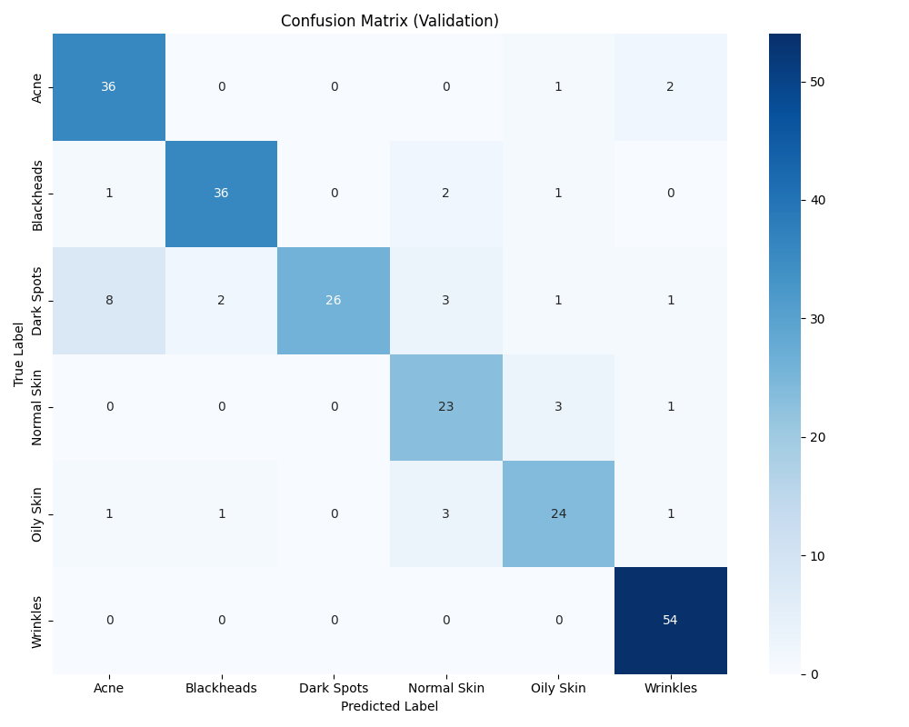

# Dokumentasi Lengkap Pembuatan Model ML: Skin Condition Classification (MobileNetV2)

Dokumen ini merangkum **end-to-end proses pembuatan model Machine Learning/Deep Learning** untuk klasifikasi kondisi kulit wajah (6 kelas) pada proyek ini, meliputi:

- Detail **pengambilan & penyiapan data**
- Detail **preprocessing & augmentasi**
- Detail **arsitektur model**
- Detail **strategi training** (two-stage training)
- Detail **evaluasi** (confusion matrix + classification report)
- Detail **ekspor model** (Keras `.h5` dan ONNX)

> Referensi implementasi utama: `prediction_model.py` (versi notebook juga tersedia di `prediction_model.ipynb`).

---

## 1. Ringkasan Proyek

### 1.1 Tujuan

Membangun model *image classification* untuk mengklasifikasikan **kondisi kulit wajah** dari gambar menjadi 6 kelas:

1. Acne
2. Blackheads
3. Dark Spots
4. Normal Skin
5. Oily Skin
6. Wrinkles

### 1.2 Output Sistem

- **Prediksi label** + **confidence** (probabilitas maksimum)
- Integrasi tambahan (di repo): **rekomendasi produk skincare** berdasarkan label (menggunakan `skincare_product/treatment.csv`).

---

## 2. Pengambilan Data & Struktur Dataset

### 2.1 Struktur Folder Dataset

Dataset disusun dalam format *folder-per-class*:

```
PMLDI/
  dataset/
    Acne/
    Blackheads/
    Dark Spots/
    Normal Skin/
    Oily Skin/
    Wrinkles/
```

Dengan format gambar yang didukung dan di-scan oleh pipeline:

- `.jpg`, `.jpeg`, `.png`, `.bmp`, `.gif`

### 2.2 Catatan Sumber Data

Di dalam repo ini **belum ada catatan eksplisit** mengenai sumber dataset eksternal (misalnya tautan Kaggle/Google Drive/roboflow) pada kode maupun README.

Agar dokumentasi ini menjadi “lengkap” versi final, bagian yang bisa Anda lengkapi (opsional, tapi disarankan):

- Sumber dataset (URL / nama dataset)
- Metode pengumpulan (download dataset publik / kurasi manual / scraping)
- Aturan lisensi dataset & atribusi

### 2.3 Pedoman Kurasi Data (praktik yang digunakan/umum)

Saat menyiapkan data untuk klasifikasi kondisi kulit, praktik yang direkomendasikan:

- Memastikan gambar dominan menampilkan area wajah/kulit
- Menghindari foto blur ekstrem, over/under-exposure ekstrem
- Menjaga label konsisten (contoh: “Dark Spots” untuk hiperpigmentasi, bukan jerawat)
- Menghapus duplikasi (dupe images) bila ada

---

## 3. Split Data (Train/Validation)

### 3.1 Split Stratified 80/20

Pipeline melakukan split **stratified** sehingga proporsi kelas di train dan validation relatif terjaga:

- `test_size=0.2` (validation 20%)
- `random_state=42`
- `stratify=labels`

Implementasi: `sklearn.model_selection.train_test_split`.

### 3.2 Alasan Stratified Split

Karena dataset multi-kelas sering tidak seimbang (class imbalance), split stratified membantu:

- Mencegah kelas minoritas “hilang” dari validation
- Membuat evaluasi lebih representatif

---

## 4. Preprocessing Gambar

### 4.1 Decoder dan Normalisasi

Pipeline preprocessing utama memakai **PIL** untuk decoding agar lebih robust terhadap variasi file gambar:

- `ImageOps.exif_transpose(img)` untuk memperbaiki orientasi dari metadata EXIF
- Konversi ke RGB (`img.convert('RGB')`)
- Resize menjadi square menggunakan `ImageOps.pad` (preserve aspect ratio + padding)
- Normalisasi menggunakan `tf.keras.applications.mobilenet_v2.preprocess_input`

### 4.2 (Opsional) Auto Face Crop

Untuk mengurangi noise background, tersedia opsi **auto-crop ke wajah** menggunakan **OpenCV Haar Cascade**:

- `ENABLE_AUTO_FACE_CROP = True`
- Memilih bounding box wajah terbesar
- Menambahkan margin crop (`FACE_CROP_MARGIN = 0.25`)

Jika OpenCV/face detection gagal, pipeline **fallback** ke gambar original (tidak crop) sehingga proses training tetap berjalan.

### 4.3 Alasan Preprocessing Ini

- MobileNetV2 expect input yang dinormalisasi via `preprocess_input`
- Crop wajah membantu fokus model ke area relevan (kulit wajah), mengurangi bias dari latar

---

## 5. Augmentasi Data

Augmentasi dilakukan pada training pipeline (tf.data) menggunakan layer Keras preprocessing:

- `RandomFlip('horizontal')`
- `RandomRotation(0.03)`
- `RandomTranslation(0.03, 0.03)`
- `RandomZoom((-0.05, 0.05), (-0.05, 0.05))`

> Augmentasi ini membantu generalisasi model terhadap variasi pose ringan, framing, dan skala.

Catatan:

- Validation dataset **tidak** diberi augmentasi.

---

## 6. Strategi Mengatasi Class Imbalance

Pipeline menggunakan **dua pendekatan**:

### 6.1 Class Weight (Balanced)

Dihitung menggunakan:

- `sklearn.utils.class_weight.compute_class_weight(class_weight='balanced', ...)`

Namun, pada implementasi training final, strategi yang dominan adalah oversampling via tf.data (lihat 6.2). Class weights tetap berguna untuk analisis distribusi kelas.

### 6.2 Oversampling dengan tf.data

Untuk menyeimbangkan jumlah sampel per kelas saat training:

1. Membuat dataset per kelas (masing-masing di-`repeat()`)
2. Menggabungkan dengan `tf.data.experimental.sample_from_datasets` menggunakan bobot sama untuk setiap kelas

Efeknya:

- Setiap batch cenderung memiliki distribusi kelas lebih seimbang
- Mengurangi risiko model bias ke kelas mayoritas

---

## 7. Arsitektur Model

### 7.1 Backbone: MobileNetV2 (Transfer Learning)

Backbone menggunakan:

- `MobileNetV2(include_top=False, weights='imagenet')`
- Input shape dibiarkan fleksibel `(None, None, 3)` pada definisi backbone

### 7.2 Classification Head

Head yang ditambahkan di atas backbone:

1. `GlobalAveragePooling2D()`
2. `Dense(128, activation='relu')`
3. `Dropout(0.3)`
4. `Dense(6, activation='softmax')`

### 7.3 Kenapa MobileNetV2?

- Ringan (lebih cocok untuk deployment web/mobile)
- Performa bagus untuk image classification dengan transfer learning
- Mudah diekspor ke ONNX

---

## 8. Strategi Training (Two-Stage Training)

Pipeline training dilakukan dalam **2 tahap** untuk stabilitas dan menjaga detail:

### 8.1 Stage 1 — Warmup (224×224)

Tujuan: melatih classifier head terlebih dahulu dengan backbone frozen.

Konfigurasi utama:

- Input size: `224×224`
- Batch size: `16`
- Backbone: `trainable = False`
- Optimizer: Adam, `lr = 1e-4`
- Epoch: `6`
- Callback:
  - EarlyStopping (patience 3, restore_best_weights)
  - ModelCheckpoint → `best_skin_model_stage1.h5` (monitor `val_accuracy`)

### 8.2 Stage 2 — Fine-tuning (320×320)

Tujuan: meningkatkan performa dengan resolusi lebih besar dan fine-tuning backbone.

Konfigurasi utama:

- Input size: `320×320`
- Batch size: `8`
- Backbone: `trainable = True`
  - Layer BatchNorm tetap di-freeze (lebih stabil saat fine-tuning)
- Optimizer: Adam, `lr = 1e-5`
- Epoch max: `20`
- Callback:
  - EarlyStopping (monitor `val_loss`, patience 10, restore_best_weights)
  - ReduceLROnPlateau (factor 0.2, patience 5, min_lr 1e-6)
  - ModelCheckpoint → `best_skin_model.h5` (monitor `val_accuracy`, save_best_only)

---

## 9. Evaluasi Model

Evaluasi dilakukan pada validation set hasil split 80/20.

### 9.1 Confusion Matrix

- Confusion matrix dihitung dengan `sklearn.metrics.confusion_matrix`
- Disimpan sebagai gambar: `confusion_matrix.png`

Gunakan ini di Markdown (sudah disediakan):



### 9.2 Classification Report

Classification report disimpan ke file: `classification_report.txt`.

Isi report (hasil terakhir yang tersimpan):

```text
              precision    recall  f1-score   support

        Acne     0.7826    0.9231    0.8471        39
  Blackheads     0.9231    0.9000    0.9114        40
  Dark Spots     1.0000    0.6341    0.7761        41
 Normal Skin     0.7419    0.8519    0.7931        27
   Oily Skin     0.8000    0.8000    0.8000        30
    Wrinkles     0.9153    1.0000    0.9558        54

    accuracy                         0.8615       231
   macro avg     0.8605    0.8515    0.8472       231
weighted avg     0.8740    0.8615    0.8586       231
```

Interpretasi singkat:

- Akurasi validasi: **0.8615**
- Kelas **Dark Spots** punya precision tinggi tetapi recall lebih rendah → indikasi cukup banyak false negative untuk kelas ini.
- Kelas **Wrinkles** menunjukkan recall sangat tinggi.

---

## 10. Penyimpanan & Ekspor Model

### 10.1 Model Keras (.h5)

- Checkpoint terbaik Stage 2: `best_skin_model.h5`
- Model final (opsional): `final_skin_model.h5`

### 10.2 Ekspor ke ONNX

Ekspor dilakukan dari model checkpoint terbaik (`best_skin_model.h5`) agar sesuai hasil evaluasi terbaik.

- Output ONNX: `best_skin_model_320.onnx`
- Input signature fixed: `[None, 320, 320, 3]` float32
- Opset: `15`

---

## 11. Inference (Prediksi) & Rekomendasi Produk

### 11.1 Prediksi 1 Gambar

Pipeline prediksi:

1. Load gambar
2. EXIF transpose + convert RGB
3. (Opsional) face-crop
4. Pad/resize ke 320×320
5. `preprocess_input`
6. `model.predict` → softmax
7. Ambil argmax + confidence

Fungsi yang tersedia:

- `predict_skin_condition(model, img_path, categories)`

### 11.2 Rekomendasi Produk

Rekomendasi diambil dari:

- `skincare_product/treatment.csv`

Fungsi:

- `show_recommendations(predicted_label)`

---

## 12. Reproducibility (Cara Menjalankan Ulang)

### 12.1 Instalasi Dependencies

Repo menyediakan file dependencies: `requirments.txt` (catatan: nama file “requirements” tertulis “requirments”).

```bash
pip install -r requirments.txt
```

### 12.2 Training + Evaluasi

Jalankan:

```bash
python prediction_model.py
```

Output yang dihasilkan/diupdate:

- `best_skin_model_stage1.h5`
- `best_skin_model.h5`
- `final_skin_model.h5`
- `confusion_matrix.png`
- `classification_report.txt`
- `best_skin_model_320.onnx`
